# TP Spark SQL — Bike Sharing

Ce dépôt contient un petit projet Java qui illustre l'utilisation d'Apache Spark (Spark SQL) pour analyser un jeu de données de location de vélos.

## Structure du projet

- `pom.xml` — configuration Maven
- `src/main/java/org/example/` — code source Java
  - `SparkSqlBikeSharing.java` — programme principal d'analyse
  - `Main.java` — éventuel point d'entrée alternatif
- `src/main/resources/bike_sharing.csv` — jeu de données CSV utilisé
- `src/main/resources/screens/` — captures d'écran (fournies)

## Pré-requis

- Java 8+ (ou version compatible avec la version de Spark utilisée)
- Maven
- Une installation de Spark n'est pas strictement nécessaire si vous utilisez les dépendances Spark via Maven, mais assurez-vous que votre `pom.xml` contient les dépendances Spark appropriées.

## Compiler et exécuter

Exemples de commandes (depuis la racine du projet) :

- Compiler :

```cmd
mvn -q clean compile
```

- Exécuter le programme principal (si le plugin exec est configuré) :

```cmd
mvn -q exec:java -Dexec.mainClass=org.example.SparkSqlBikeSharing
```

Ou exécuter avec la classe compilée :

```cmd
java -cp "target/classes;target/dependency/*" org.example.SparkSqlBikeSharing
```

(Remplacez la commande ci‑dessus par la méthode d'exécution adaptée à votre configuration Maven/Spark.)

## Jeu de données

Le CSV `bike_sharing.csv` se trouve dans `src/main/resources/` et est chargé par `SparkSqlBikeSharing` via un chemin relatif. Assurez-vous que ce fichier est présent avant d'exécuter l'application.

## Figures (captures d'écran)

Ci-dessous la documentation de chaque capture fournie dans `src/main/resources/screens/` : un titre, une courte description et l'image intégrée. Ces figures aident à comprendre la sortie et le comportement attendu du programme.


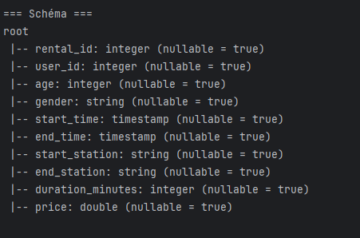

Figure 1 — Schéma du DataFrame

Description : affiche le schéma (colonnes et types) du DataFrame après le chargement du CSV. Permet de vérifier que l'inférence de schéma et les noms de colonnes sont corrects.

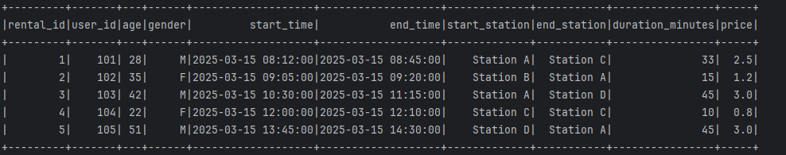

Figure 2 — Premières lignes du jeu de données

Description : montre les premières lignes (ex. df.show(5)). Utile pour valider le format des colonnes (dates, entiers, chaînes) et repérer valeurs manquantes ou anomalies.

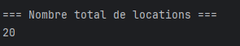

Figure 3 — Nombre total de locations

Description : capture illustrant l'affichage du nombre total de locations (résultat de df.count()). Sert de métrique d'ensemble rapide.

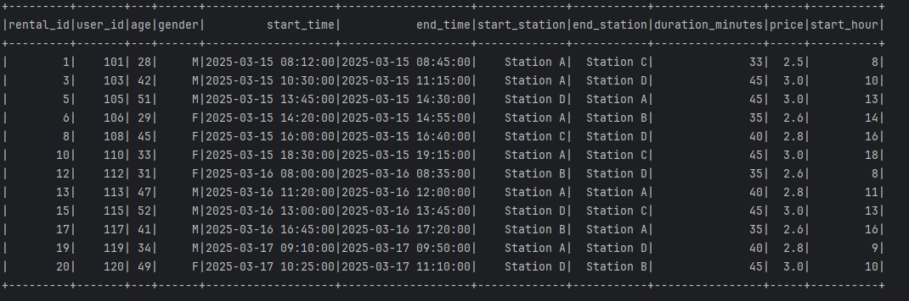

Figure 4 — Requêtes SQL exemples

Description : exemple d'exécution de requêtes Spark SQL sur la vue temporaire (sélections, filtres). Montre la syntaxe et résultats attendus.


Figure 5 — Agrégations par station

Description : résultat d'une agrégation GROUP BY start_station avec le nombre de locations par station. Permet d'identifier les stations les plus actives.

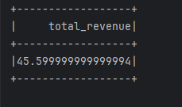

Figure 6 — Durée moyenne par station

Description : affiche l'AVG(duration_minutes) par station — utile pour repérer stations avec trajets plus longs en moyenne.

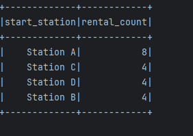

Figure 7 — Heures de pointe (locations par heure)

Description : histogramme/tableau des locations par heure (colonne start_hour). Identifie les heures de pointe (matin/soir).

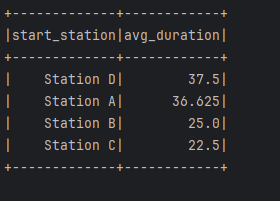

Figure 8 — Station la plus populaire

Description : résultat de la requête LIMIT 1 qui retourne la station avec le plus grand nombre de locations.

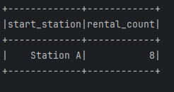

Figure 9 — Analyse matin (7–12h)

Description : montre la station la plus populaire sur la plage horaire matin (7–12h). Utile pour les analyses temporelles ciblées.

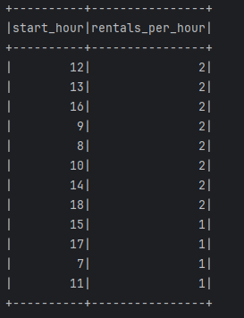

Figure 10 — Tranche d'âge

Description : distribution des locations par tranche d'âge (ex. 18-30, 31-40, ...). Permet d'analyser le profil des utilisateurs.

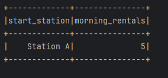

Figure 11 — Répartition par genre

Description : tableau/graphique montrant le nombre d'utilisateurs par genre (male/female/other). Aide à l'analyse démographique.

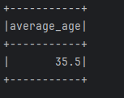

Figure 12 — Analyses complémentaires

Description : captures additionnelles montrant d'autres requêtes ou visualisations (ex. revenue, top N, filtres spécifiques).

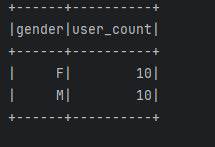

Figure 13 — Résumé / rapport final

Description : écran de synthèse ou export final du rapport — récapitule les métriques principales et conclusions.

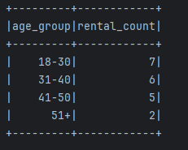

> Conseils rapides : si vous voulez alléger le dépôt, redimensionnez les images avant commit ou créez une galerie HTML distincte pour une mise en page plus riche.

## Notes et bonnes pratiques

- Si vous ajoutez de grosses images ou souhaitez améliorer la mise en page, pensez à redimensionner les images dans `src/main/resources/screens/` ou à créer une galerie HTML séparée.
- Vérifiez la compatibilité des versions Spark/Maven si vous rencontrez des erreurs d'exécution.

## Contact

Pour toute question sur le TP, contactez l'auteur ou ouvrez une issue.

---

README généré automatiquement.
